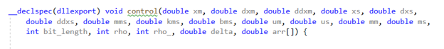
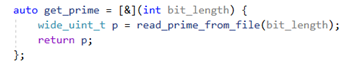

Encryption Homomorphic 

The controller architecture and motor signals are processed in homomorphic encryption to avoid data leaking. The homomorphic encryption is written in C++ due to the large data size. They are performed in a single equation of “control” that returns an array of master and slave torque, as shown in X1. The control equation includes all the subfunctions and runs the control scheme. The subfunctions have the format of [&] to access data to other subfunctions, as shown in X2.  
 
 
 

    Y1. Control equation

 

 

    Y2. Subfunction format

 

Since the Simulink S-function only uses the compilation version of C++14, the control scheme must be exported to dll that is compiled in C++20. In Visual Studio, the configuration type is set up Dynamic Library, and __declspec(dllexport) exports function to the dll. Extern “C” was used to ensure that the function names are un-mangled so that the binary files are exported with unchanged names. 
