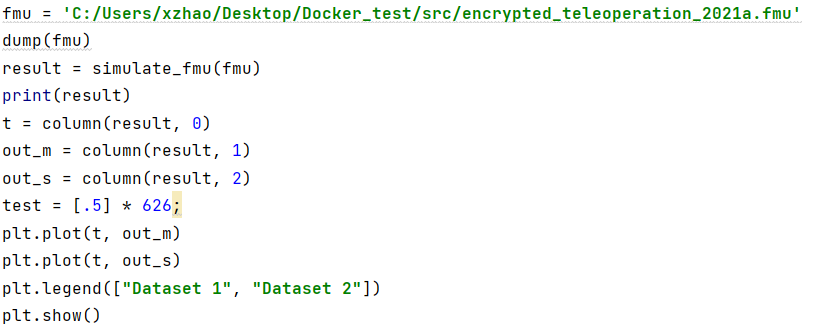
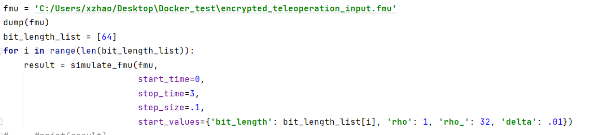

FMI is an open standard for exchanging dynamical simulation models between different tools in a standardized format. The functional Mock-up Unit is a zip file that contains a simulation model that adheres to the FMI standard. Therefore, the model can be reused and repurposed for different applications.

FMU includes an XML file that defines the structure and binary files that implements the function. Since binary files can only be run on the platform they are compiled for, most FMUs are restricted to running on a single platform such as Windows 64-bit or Linux 32-bit [1]. 

FMPy is a free Python library to simulate Functional Mock-up Units (FMUs) that supports Co-Simulation and Model Exchange. For a model that requires no input, the model can run directly by calling simulate_fmu, as shown in X1. The self-made function column gives access to the output data. For a model that needs constant variable input, the model can be run by setting the start value for each parameter, as shown in X2.  
 

    X1. No-Input Model Simulation 

 
 

    X2. Input Model Simulation 

 
