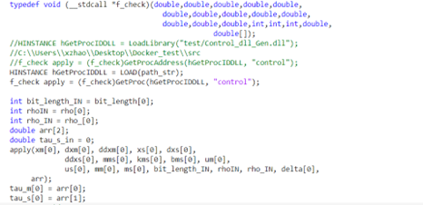
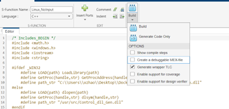
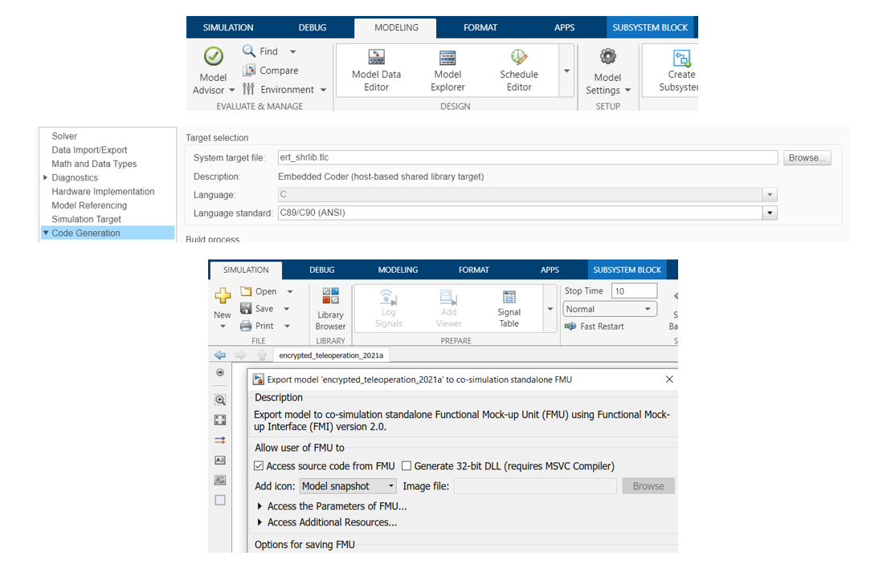

With the complexity of the encrypted control scheme, it is more efficient to write the control scheme in C++ and access it by Simulink through the S-function block. The S-function builder integrates a C/C++ code by building a C MEX S-function. The MEX functions can interface the algorithm and call the C++ as if they are MATLAB built-in functions. The resulted file is application programming interface(either a .mexa64, .mexmaci64 or .mexw64 file).

Inside the s function, the S-function will load the previously compiled dll. _stdcall tells the compiler the rules for setting up the stack, pushing arguments, and getting a return value. LoadLibrary()/dlopen() is used to load the library, GetProcAddress()/dlsym() is used to load the symbols and call the function, as shown in Z1.  
 

    Z1: S-function builder

 
     
In a real-time environment, generic API calls can be unacceptably slow, especially when many solution steps are involved. The code generator can speed up S-functions in standalone applications that it generates by embedding user-written algorithms within auto-generated functions, rather than indirectly calling S-functions via the generic API. This form of optimization is called inlining. TLC inlines S-functions, resulting in faster, optimized code[1]. To inline the S-function, clicks on the generating Wrapper TLC while building the S-function, as shown in X2.  
 
 

    Z2: Generate Wrapper TLC

 

To export the Simulink into FMU, in the Model settings, check the fixed-step solver and change the system target file to ert_shrlib, which generates a shared library target. Then, it is ready to export to FMU!
 
 
 

    Z2: Export to FMU

 

Reference: 
[1] https://www.mathworks.com/help/rtw/tlc/inlining-s-functions-with-tlc.html
